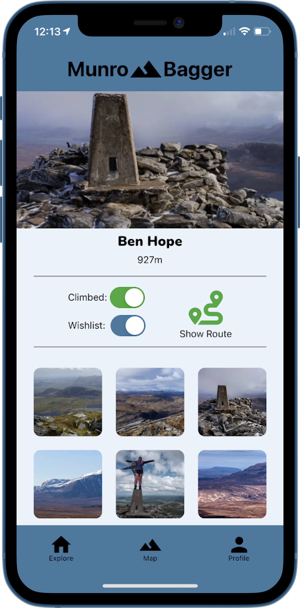
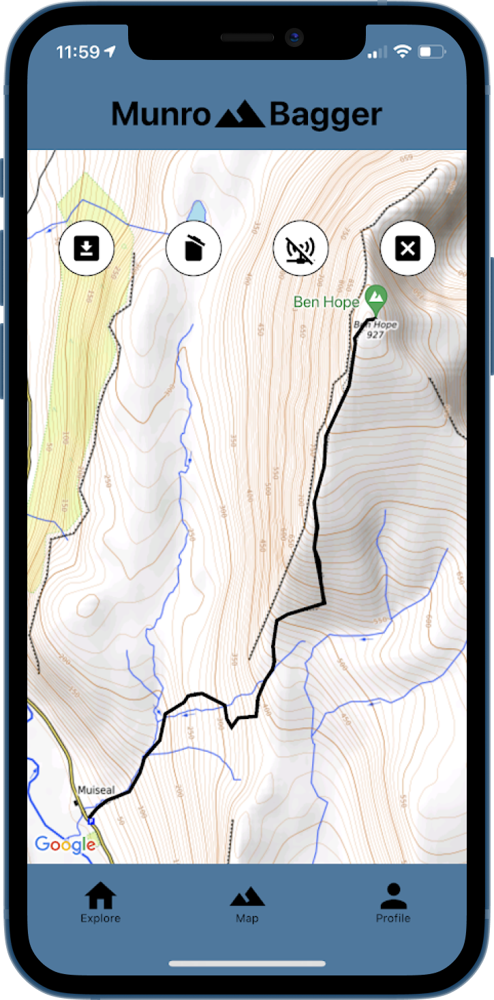

# Munro Bagger

An app documenting all 282 Scottish Mountains (Munros). Munro Bagger aids climbers to explore, plan and share their adventures and upload images while providing topographical data and navigational quality maps.

## Screenshots

<p float="left">


 
</p>

# Tech Stack

## Back-End

- Sequelize (using postgreSQL)
- Express
- Node.js
- TypeScript

## Front-End

- React Native
- TypeScript
- Expo
- Redux Toolkit
- Axios
- Auth0

# Setup

1. Clone repo

```
git clone https://github.com/jonbrook/munro-bagger.git
cd munro-bagger
```

2. Install dependancies

```
cd backend && yarn && cd ../frontend && yarn
```

3. Create environment variable files\

```
Create .env files using the examples in both the frontend and backend
```

4. Run database service

```
docker-compose up -d
```

5. Run backend

```
cd backend && yarn start
```

6. Run frontend

```
cd frontend && yarn start
```

7. Seed the database

```
cd backend && npx sequelize-cli db:seed:all
```

# Features

- Complete listing of all 282 Scottish Mountains
- Topographical data and navigational quality mapping
- Auth0 Authentication and Login
- Cloudanairy Integration to enable photo upload
- GPX Routing for selected Mountains

# Suggested Improvements

- Source mountain profile pictures and routings for all mountains
- Add unit, integration and end to end test suites

# Contributors 

- <a href="https://github.com/daveybell26">David Bell</a>
- <a href="https://github.com/Rankz">Ian Michaels</a>
- <a href="https://github.com/jonbrook">Jon Brook</a>
- <a href="https://github.com/KonGkal">Konstantinos Gkalitsas</a>
- <a href="https://github.com/stekeb">Steffen Keilbach</a>
